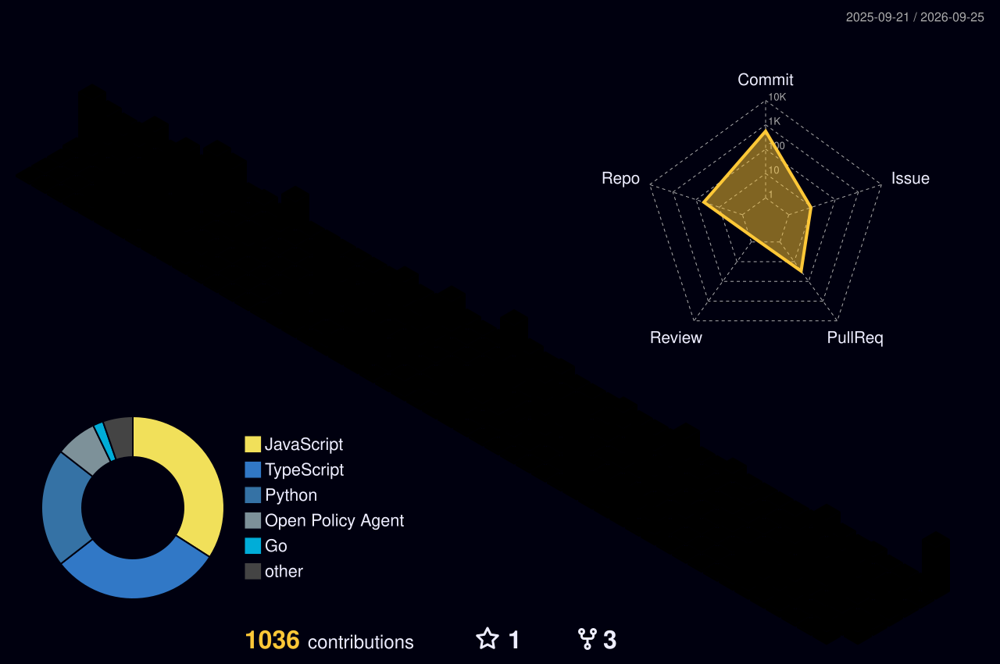

<p align="center">
  
</p>

<h1 align="center">Khuswant Rajpurohit</h1>

<p align="center">
  full-stack & AI engineer &nbsp;·&nbsp; Kubescape (CNCF) contributor &nbsp;·&nbsp; Delhi, India
</p>

<p align="center">
  <a href="https://khuswant18.github.io/Portfolio/"></a>
  <a href="https://www.linkedin.com/in/khuswant-rajpurohit-b749ba30a/"></a>
  <a href="https://x.com/KhuswantRa45688"></a>
  <a href="https://youtube.com/@khuswantrajpurohit"></a>
  <a href="mailto:khuswantrajpurohit18@gmail.com"></a>
</p>

<br/>

I build full-stack and AI products, and I spend a lot of my evenings inside Kubernetes security tooling — mostly [Kubescape](https://github.com/kubescape), where I've had 17 PRs merged across the eBPF node-agent, the Rego rule library, the operator, the Helm charts and the core CLI.

Right now I'm going deeper on distributed systems and Kubernetes internals. If you're working on something in that space, or on agentic AI that solves a real business problem, I'd like to hear about it.

```console
khuswant@delhi ~ % whoami
────────────────────────────────────────────────────────
 name       Khuswant Rajpurohit
 based in   Delhi, India
 does       full-stack · AI agents · cloud-native OSS
 writes     TypeScript, Go, Python, Rego
 upstream   kubescape (CNCF) · harbor-next · kube-burner
 learning   distributed systems, k8s internals, eBPF
 open to    internships, collabs, open-source work
```

<br/>

## Open source

<table>
<tr>
<td align="center" width="25%">
  <a href="https://github.com/kubescape"></a><br/>
  <b>Kubescape</b><br/>
  <sub>CNCF · Kubernetes security</sub><br/><br/>
  
</td>
<td align="center" width="25%">
  <a href="https://github.com/container-registry/harbor-next"></a><br/>
  <b>Harbor Next</b><br/>
  <sub>container registry</sub><br/><br/>
  
</td>
<td align="center" width="25%">
  <a href="https://github.com/kube-burner/kube-burner"></a><br/>
  <b>kube-burner</b><br/>
  <sub>k8s perf & scale testing</sub><br/><br/>
  
</td>
<td align="center" width="25%">
  <a href="https://github.com/zero-to-mastery/Animation-Nation"></a><br/>
  <b>Animation-Nation</b><br/>
  <sub>CSS / JS animations</sub><br/><br/>
  
</td>
</tr>
</table>

## 🛠️ Tech stack

<table align="center">
<tr><td align="center"><b>Languages</b></td><td></td></tr>
<tr><td align="center"><b>Frontend</b></td><td></td></tr>
<tr><td align="center"><b>Backend</b></td><td></td></tr>
<tr><td align="center"><b>Databases</b></td><td></td></tr>
<tr><td align="center"><b>DevOps & Cloud</b></td><td></td></tr>
<tr><td align="center"><b>Tools</b></td><td></td></tr>
</table>

<p align="center"><b>AI / ML</b><br>
  
  
  
  
  
  
  
  
  
  
  
  
  
  
  
</p>

<p align="center"><b>Cloud-Native Security</b><br>
  
  
  
  
  
  
</p>

<br/>

## Contributions

<picture>
  <source media="(prefers-color-scheme: dark)" srcset="profile-3d-contrib/profile-night-rainbow.svg" />
  <source media="(prefers-color-scheme: light)" srcset="profile-3d-contrib/profile-green-animate.svg" />
  
</picture>

<br/>

<a href="https://holopin.io/@khuswant18"></a>
